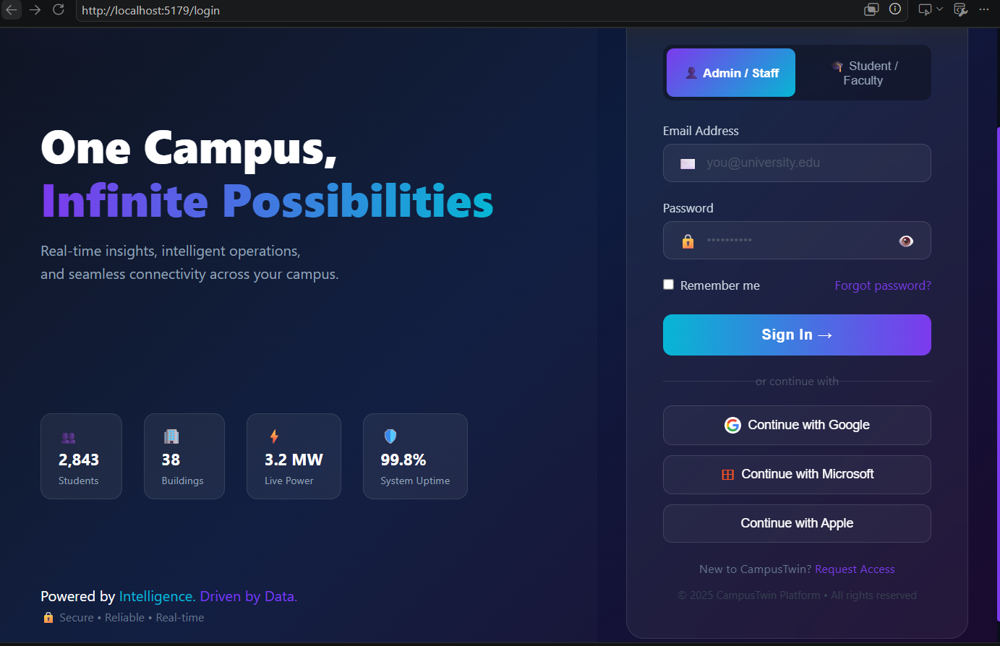
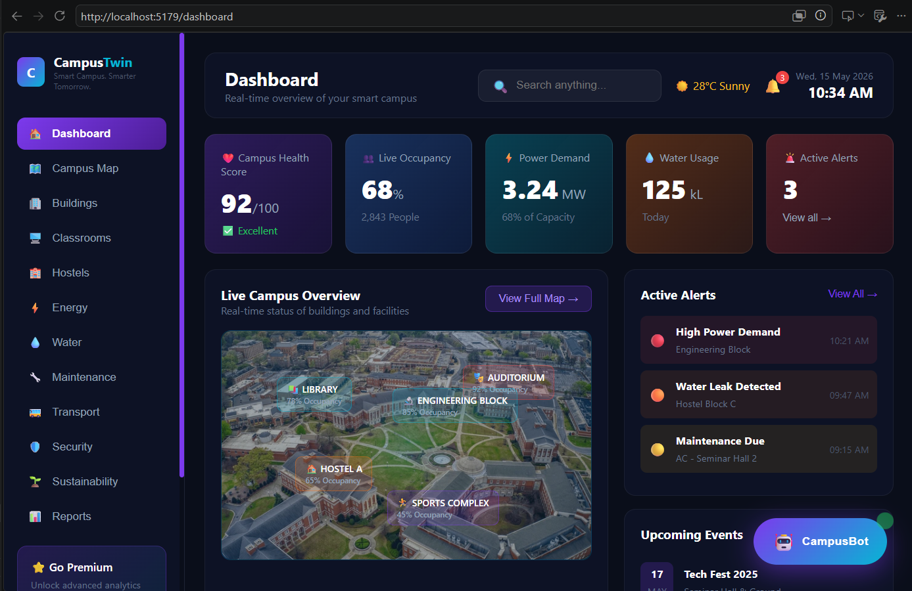
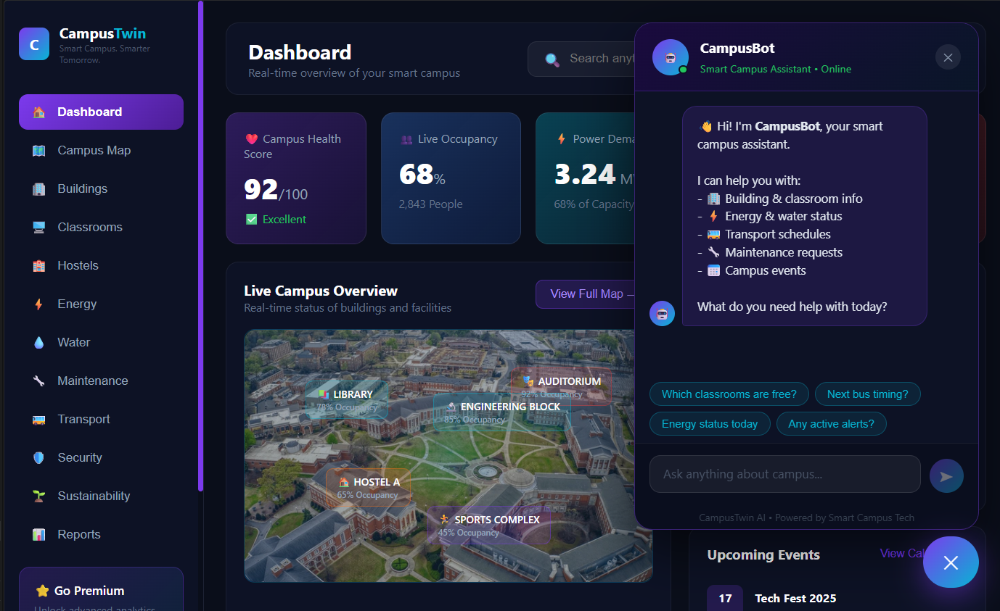

# CampusTwin 🏫
CampusTwin is a full-stack smart campus management web application designed to digitize and streamline university operations. Built with React and Node.js, it provides administrators, faculty, and students with a unified platform featuring a real-time analytics dashboard, AI-powered campus assistant (CampusBot), live building occupancy monitoring, energy and water consumption tracking, classroom booking, hostel management, transport scheduling, maintenance reporting, and security alert systems. 

## Features
-  Real-time Dashboard
- AI Chatbot (CampusBot)
- Energy & Water Monitoring
- Building Management
- Transport Tracking
-  Security Alerts
-  Sustainability Metrics
## Login Page

## Dashboard

## CampusBot

##Tech Stack
React.js
JavaScript
HTML5
CSS3
Bootstrap
React Router DOM
Vite

## Run Locally
npm install
node server.cjs   ← Terminal 1
npm run dev       ← Terminal 2
node server.cjs   ← Terminal 1
npm run dev       ← Terminal 2